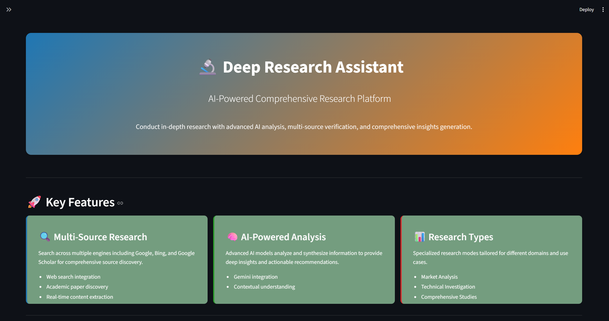
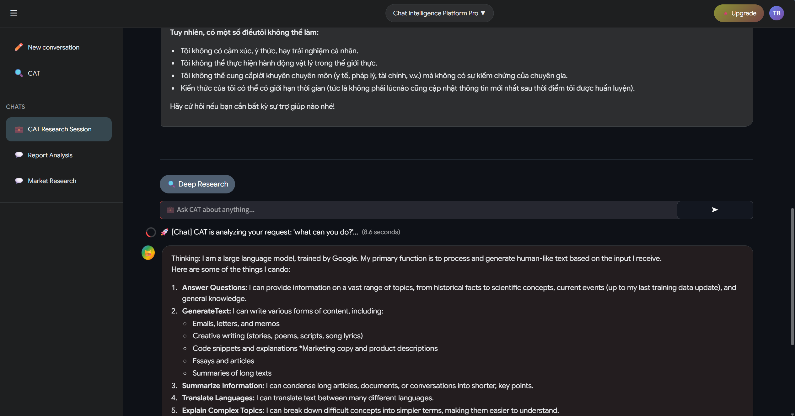

# Chat UI Streamlit

[](https://streamlit.io)
[](LICENSE)

This project follows a clean, modular architecture:

```text
src/chat_ui_streamlit/
├── core/                  # Core configuration and constants
│   ├── config.py          # Application configuration
│   └── constants.py       # Application constants
├── ui/                    # User interface components
│   ├── components/        # Reusable UI components
│   │   ├── chat_component.py
│   │   ├── header_component.py
│   │   ├── home_component.py
│   │   └── sidebar_component.py
│   ├── pages/            # Streamlit pages
│   │   └── CAT_Deep_Research.py
│   ├── styles/           # CSS styling
│   └── Homepage.py       # Main entry point
└── tests/                # Test suite
```

### Project Structure Guidelines

- **Core Module**: Contains configuration, constants, and core business logic
- **UI Module**: Houses all user interface components and pages
- **Components**: Reusable UI elements that can be imported across pages
- **Pages**: Individual Streamlit pages representing different application views
- **Styles**: CSS files for custom styling

A modern, AI-powered chat interface built with Streamlit and Google Gemini, designed for intelligent conversations and deep research capabilities.

## 🖼️ Screenshots

### Homepage



### Chat Interface



## 🎯 Features

- **Modern UI/UX**: Clean, responsive interface built with Streamlit
- **AI-Powered Chat**: Integration with Google Gemini for intelligent conversations
- **Deep Research**: Advanced research capabilities with structured analysis
- **Component-Based Architecture**: Modular design for maintainability and scalability
- **Environment Configuration**: Secure API key management with Pydantic settings
- **Real-time Interactions**: Seamless chat experience with instant responses

## 🚀 Quick Start

### Prerequisites

- Python 3.11+
- Google Gemini API Key

### Installation

1. **Clone the repository**

   ```bash
   git clone https://github.com/Bang-tv259/Chatbot-streamlit.git
   cd Chat-UI-Streamlit
   ```

2. **Install dependencies**

   ```bash
   # Using pip
   pip install -e .

   # Or using uv (recommended)
   uv sync --all-packages
   ```

3. **Environment Configuration**

   Create a `.env` file in the project root:

   ```env
   CHAT_UI_GEMINI_API_KEY=your_gemini_api_key_here
   ```

4. **Run the application**

   ```bash
   streamlit run src/chat_ui_streamlit/ui/Homepage.py
   ```

5. **Access the application**

   Open your browser and navigate to `http://localhost:8501`

## ⚙️ Configuration

The application uses Pydantic Settings for configuration management. All settings can be configured via environment variables with the `CHAT_UI_` prefix:

| Environment Variable     | Description           | Required |
| ------------------------ | --------------------- | -------- |
| `CHAT_UI_GEMINI_API_KEY` | Google Gemini API Key | Yes      |

## 🔧 API Integration

The application integrates with Google Gemini AI for chat capabilities:

```python
from chat_ui_streamlit.core.config import config

# Configuration is automatically loaded from environment
api_key = config.gemini_api_key
```

## 📦 Dependencies

### Production Dependencies

- **streamlit**: Web application framework
- **pydantic**: Data validation and settings management
- **pydantic-settings**: Settings management for Pydantic
- **google-generativeai**: Google Gemini AI integration

### Development Dependencies

- **pytest**: Testing framework
- **mypy**: Static type checker
- **ruff**: Fast Python linter and code formatter

## 🤝 Contributing

1. Fork the repository
2. Create a feature branch (`git checkout -b feature/amazing-feature`)
3. Commit your changes (`git commit -m 'Add some amazing feature'`)
4. Push to the branch (`git push origin feature/amazing-feature`)
5. Open a Pull Request

### Development Guidelines

- Follow PEP 8 style guidelines
- Write comprehensive tests for new features
- Update documentation for any API changes
- Use type hints for all function signatures

## 📋 Changelog

### Version 0.1.2

- Initial release with core chat functionality
- Google Gemini integration
- Component-based UI architecture
- Environment-based configuration

## 🐛 Deployment

- Streamlit Cloud deployments: <https://cat-chatbot.streamlit.app/>

## 📄 License

This project is licensed under the MIT License - see the [LICENSE](LICENSE) file for details.

## 🙏 Acknowledgments

- [Streamlit](https://streamlit.io/) for the amazing web framework
- [Google Gemini](https://deepmind.google/technologies/gemini/) for AI capabilities
- [Pydantic](https://pydantic.dev/) for robust data validation

## 📞 Support

For support, email <cat@cat.com> or open an issue on GitHub.

---

Built with ❤️ by Cat | Powered by Streamlit & Google Gemini
